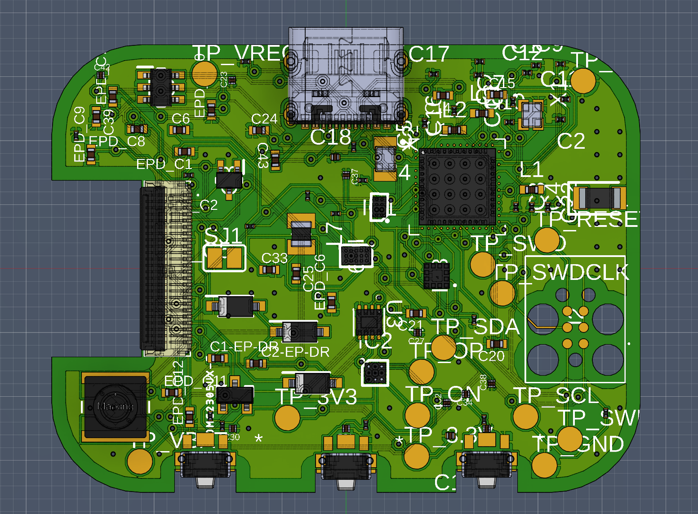
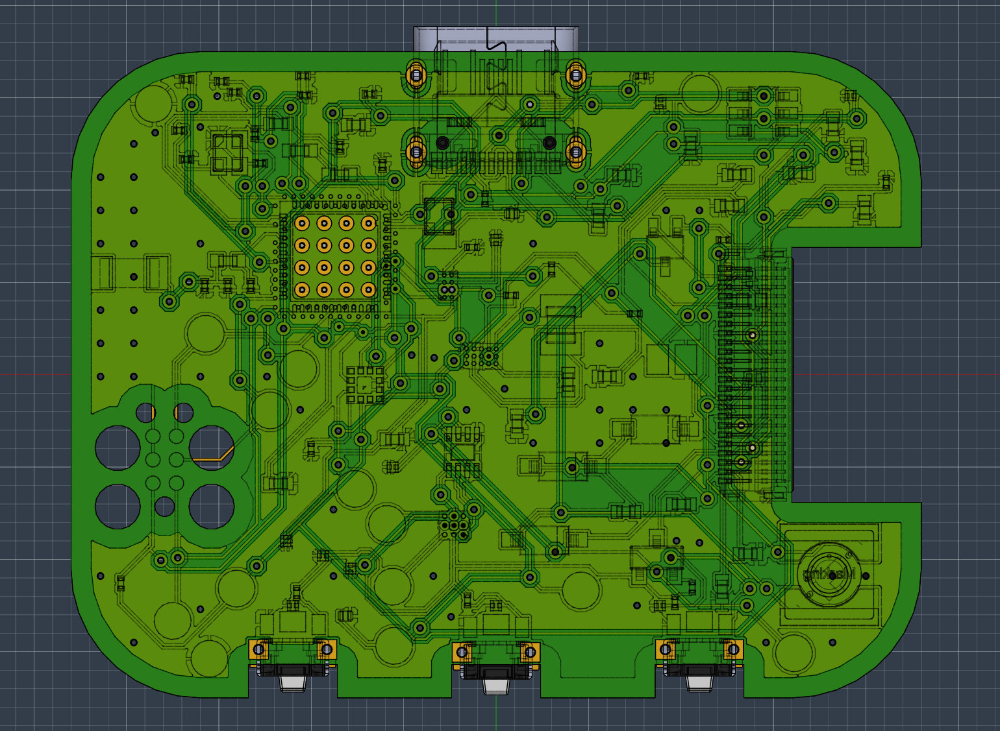
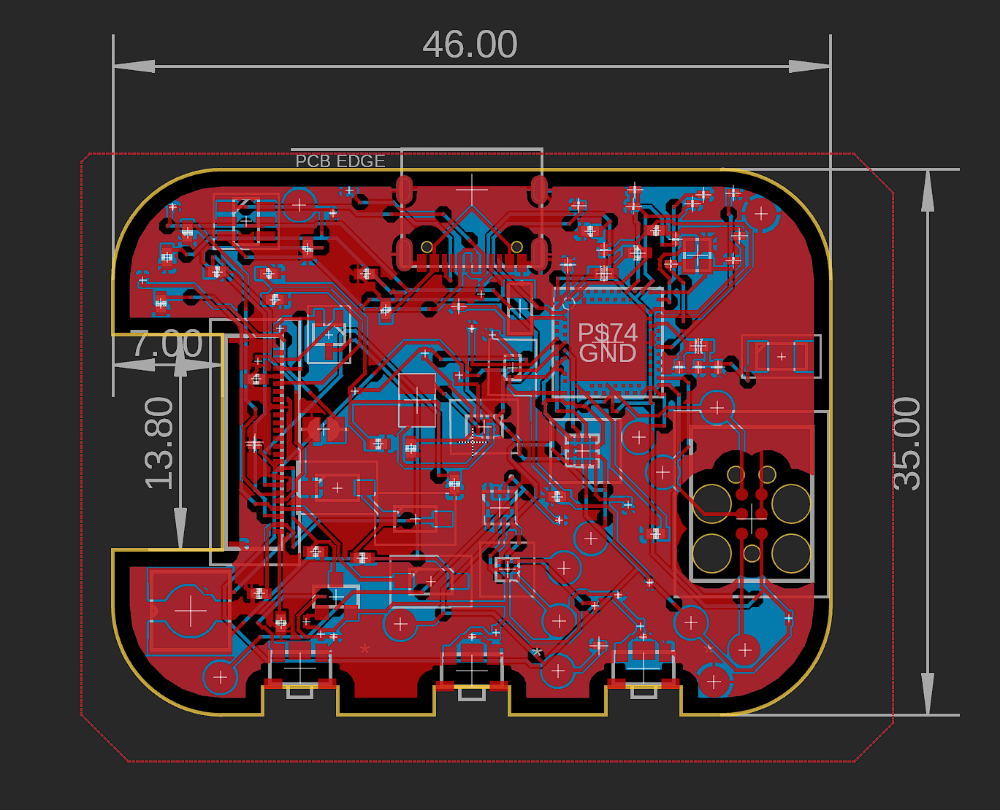
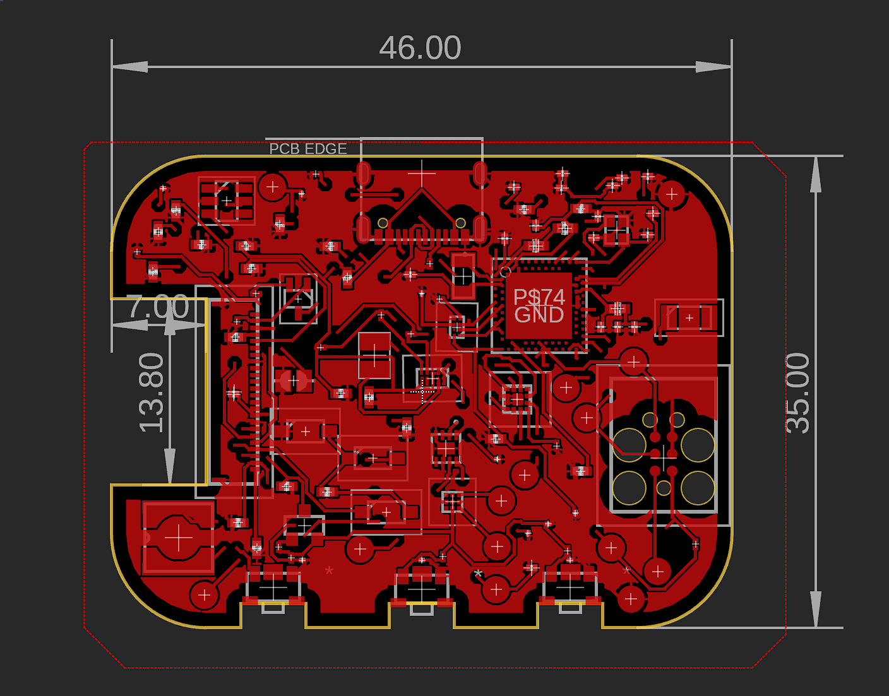
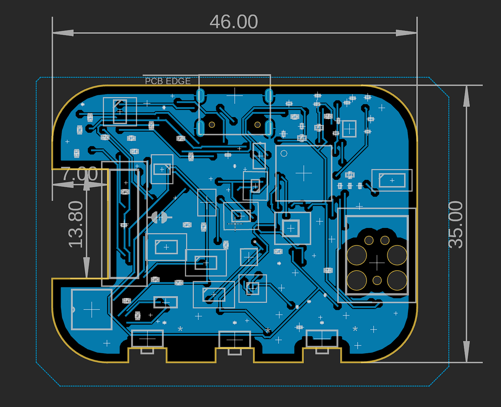

# Smartwatch — TSC Project

> A custom-designed smartwatch based on the **Nordic nRF52840** SoC, featuring an e-paper display interface, haptic feedback, accelerometer-based motion sensing, LiPo battery management, and Bluetooth Low Energy connectivity. The PCB measures **46 × 35 mm** with rounded corners and is designed to fit inside a 3D-printed enclosure.

---

## Table of Contents

1. [Block Diagram](#block-diagram)
2. [Bill of Materials (BOM)](#bill-of-materials-bom)
3. [Hardware Description](#hardware-description)
4. [nRF52840 Pin Assignments](#nrf52840-pin-assignments)
5. [PCB Images](#pcb-images)
6. [Mechanical / Enclosure](#mechanical--enclosure)
7. [Design Notes](#design-notes)

---

## Block Diagram

```
                          ┌───────────────────────────────────────────────────────────────────┐
                          │                        nRF52840 (U1)                              │
                          │   ARM Cortex-M4F @ 64 MHz · 1 MB Flash · 256 KB RAM · BLE 5.0   │
                          └──┬──────────┬──────────┬──────────┬──────────┬──────────┬────────┘
                             │          │          │          │          │          │
                    SPI Bus  │   I2C Bus│  I2C Bus │  GPIO    │  SWD     │  GPIO    │  GPIO
                             │          │          │          │          │          │
               ┌─────────────▼──┐  ┌───▼────┐ ┌──▼──────┐  │   ┌──────▼──────┐  ┌▼───────┐
               │  E-Paper (EPD) │  │ BMA423 │ │DRV2605  │  │   │ TC2030-IDC  │  │ 3× SW  │
               │  24-pin FPC    │  │ Accel. │ │ Haptic  │  │   │ SWD Debug   │  │(UP/DN/ │
               │  (J1 Molex)    │  │ (IC3)  │ │ Driver  │  │   │ Connector   │  │  ENT)  │
               └────────────────┘  └────────┘ │ (IC2)   │  │   └─────────────┘  └────────┘
                                              └─────────┘  │
                                                           │
                          ┌────────────────────────────────┼──────────────────────────────────┐
                          │              Power System       │                                  │
                          │                                 │                                  │
               ┌──────────▼──┐   ┌──────────┐   ┌────────▼──────┐   ┌──────────────────┐   │
               │ USB Type-C  │   │BQ25180   │   │  MAX17048     │   │   RT6160AWSC     │   │
               │  (J4)       ├──►│ LiPo     │   │  Fuel Gauge   │   │  Buck-Boost Reg. │   │
               │ + ESD D3    │   │ Charger  │   │  (U3) I2C     │   │  (IC9) I2C       │   │
               └─────────────┘   │ (IC1)    │   └───────────────┘   └──────────────────┘   │
                                 └────┬─────┘                                                │
                                      │ VBAT                                                 │
                                 ┌────▼─────┐                                                │
                                 │  LiPo    │                                                │
                                 │ Battery  │                                                │
                                 │ (J3 pad) │                                                │
                                 └──────────┘                                                │
                                                                                             │
               ┌──────────────────────────────────────────────────────────────────┐          │
               │                    RF Front-End                                   │          │
               │  32 MHz XTAL (X1) · 32.768 kHz XTAL (X2) · ANT1 2.45 GHz       │◄─────────┘
               │  Matching network: L1 3.9 nH · L2 10 µH · L3 15 nH             │
               └──────────────────────────────────────────────────────────────────┘
```

---

## Bill of Materials (BOM)

> Procurement links point to **JLCPCB Parts** where available; datasheets linked to official manufacturer sources.

| Ref(s) | Qty | Value / Part | Description | Package | JLCPCB / Buy Link | Datasheet |
|---|---|---|---|---|---|---|
| U1 | 1 | NRF52840-QIAA | Nordic nRF52840 SoC — main MCU, BLE 5.0, ARM Cortex-M4F | AQFN-73 (aQFN50) | [JLCPCB C190794](https://jlcpcb.com/partdetail/NordicSemiconductor-NRF52840_QIAA/C190794) | [Datasheet](https://infocenter.nordicsemi.com/pdf/nRF52840_PS_v1.7.pdf) |
| IC1 | 1 | BQ25180YBGR | 1-cell LiPo charger, I²C programmable, 1 A | 8-DSBGA (1.6×1.1 mm) | [JLCPCB C2828062](https://jlcpcb.com/partdetail/TexasInstruments-BQ25180YBGR/C2828062) | [Datasheet](https://www.ti.com/lit/ds/symlink/bq25180.pdf) |
| IC2 | 1 | DRV2605YZFR | Haptic driver for ERM/LRA motors, I²C, built-in waveform library | 9-BGA (1.44×1.44 mm) | [JLCPCB C529659](https://jlcpcb.com/partdetail/TexasInstruments-DRV2605YZFR/C529659) | [Datasheet](https://www.ti.com/lit/ds/symlink/drv2605.pdf) |
| IC3 | 1 | BMA423 | Triaxial 12-bit accelerometer, step counter, I²C/SPI | LGA-12 (2×2 mm) | [JLCPCB C332973](https://jlcpcb.com/partdetail/BoschSensortec-BMA423/C332973) | [Datasheet](https://www.bosch-sensortec.com/media/boschsensortec/downloads/datasheets/bst-bma423-ds000.pdf) |
| IC9 | 1 | RT6160AWSC | Buck-boost DC-DC converter, I²C, 15-pin WL-CSP | BGA-15 (1.4×2.3 mm) | [JLCPCB C2834980](https://jlcpcb.com/partdetail/Richtek-RT6160AWSC/C2834980) | [Datasheet](https://www.richtek.com/assets/product_file/RT6160A/DS6160A-00.pdf) |
| U3 | 1 | MAX17048G+T10 | 1-cell/2-cell LiPo fuel gauge, I²C ModelGauge | TDFN-8 (2×2 mm) | [JLCPCB C368489](https://jlcpcb.com/partdetail/MaximIntegrated-MAX17048G_T10/C368489) | [Datasheet](https://www.analog.com/media/en/technical-documentation/data-sheets/MAX17048-MAX17049.pdf) |
| J1 | 1 | 503480-2400 | Molex 0.5 mm FPC/FFC 24-circuit RA SMT dual-contact connector (EPD) | — | [Mouser 538-503480-2400](https://www.mouser.com/ProductDetail/Molex/503480-2400) | [Datasheet](https://www.molex.com/en-us/products/part-detail/5034802400) |
| J2 | 1 | TC2030-IDC | Tag-Connect 6-pin SWD programming/debug header (no-drill) | TC2030IDC | [Tag-Connect](https://www.tag-connect.com/product/tc2030-idc-nl) | [Info](https://www.tag-connect.com/wp-content/uploads/bsk-pdf-manager/TC2030-IDC-NL_Datasheet_8.pdf) |
| J4 | 1 | KH-TYPE-C-16P | USB Type-C 16-pin SMT receptacle | — | [LCSC C2832](https://www.lcsc.com/product-detail/USB-Connectors_Kinghelm-KH-TYPE-C-16P_C2832.html) | [Datasheet](https://www.kinghelm.com.cn/product/kh-type-c-16p.html) |
| ANT1 | 1 | 2450AT18B100E | 2.45 GHz chip antenna for BLE | 3216 (1.4 mm H) | [JLCPCB C341461](https://jlcpcb.com/partdetail/JohansonTechnology-2450AT18B100E/C341461) | [Datasheet](https://www.johansontechnology.com/datasheets/2450AT18B100E/2450AT18B100E.pdf) |
| D3 | 1 | USBLC6-2SC6Y | USB ESD protection TVS diode array | SOT-23-6 | [JLCPCB C2687116](https://jlcpcb.com/partdetail/STMicroelectronics-USBLC6_2SC6Y/C2687116) | [Datasheet](https://www.st.com/resource/en/datasheet/usblc6-2.pdf) |
| D2, D4, D5 | 3 | MBR0530 | Schottky diode, 30 V / 500 mA | SOD-123 | [JLCPCB C424037](https://jlcpcb.com/partdetail/OnSemiconductor-MBR0530/C424037) | [Datasheet](https://www.onsemi.com/pdf/datasheet/mbr0530-d.pdf) |
| Q3 | 1 | SI1308EDL-T1-GE3 | N-channel MOSFET, 30 V / 1.5 A | SC-70 (SOT-323) | [JLCPCB C145826](https://jlcpcb.com/partdetail/VishayIntertech-Si1308EDL_T1_GE3/C145826) | [Datasheet](https://www.vishay.com/docs/63533/si1308edl.pdf) |
| DMG2305UX-7 | 1 | DMG2305UX-7 | P-channel MOSFET, 20 V / 4.2 A | SOT-23 | [JLCPCB C145702](https://jlcpcb.com/partdetail/Diodes-DMG2305UX7/C145702) | [Datasheet](https://www.diodes.com/assets/Datasheets/DMG2305UX.pdf) |
| SW_UP, SW_DN, SW_ENT | 3 | EVP-AKE31A | Panasonic SMD tactile push-button | — | [Digi-Key P123437TR-ND](https://www.digikey.com/en/products/detail/panasonic-electronic-components/EVP-AKE31A/3071225) | [Datasheet](https://industrial.panasonic.com/cdbs/www-data/pdf/ATV0000/ATV0000CE22.pdf) |
| X1 | 1 | 32 MHz crystal | RF clock for nRF52840 BLE | 2016 (2.0×1.6 mm) | [JLCPCB C9003](https://jlcpcb.com/partdetail/9003-CX2016DB32000D0GEJCC/C9003) | [Nordic recommended crystals](https://infocenter.nordicsemi.com/topic/ps_nrf52840/chapters/radio/doc/radio.html) |
| X2 | 1 | 32.768 kHz crystal | RTC/low-power clock | 3215 (3.2×1.5 mm) | [JLCPCB C32346](https://jlcpcb.com/partdetail/Hosonic-E3SB32E002400TR/C32346) | [Nordic RTC guidance](https://infocenter.nordicsemi.com/topic/ps_nrf52840/chapters/clock/doc/clock.html) |
| L1 | 1 | 3.9 nH inductor | RF matching, 0402 | 0402 | [JLCPCB C70268](https://jlcpcb.com/partdetail/70268-CL05NPC3N9BANC/C70268) | — |
| L2 | 1 | 10 µH inductor | BLE DC supply filter, 0402 | 0402 | [JLCPCB C1046](https://jlcpcb.com/partdetail/1046-CL31A226KAHNNNE/C1046) | — |
| L3 | 1 | 15 nH inductor | RF matching, 0402 | 0402 | [JLCPCB C70268](https://jlcpcb.com/partdetail/70268-CL05NPC3N9BANC/C70268) | — |
| L5 | 1 | 744043680 (68 µH) | Würth EP power inductor for buck-boost | 4828 (WE-TPC) | [JLCPCB C408386](https://jlcpcb.com/partdetail/WurthElektronik-744043680/C408386) | [Datasheet](https://www.we-online.com/en/components/products/WE-TPC#744043680) |
| L7 | 1 | FTC252012SR47MBCA | 0.47 µH power inductor for battery charger | MLP2016 (2×1.6 mm) | [JLCPCB C5832368](https://jlcpcb.com/partdetail/6763488-FTC252012SR47MBCA/C5832368) | [Datasheet](https://product.tdk.com/en/search/inductor/inductor/smd/info?part_no=FTC252012SR47MBCA) |
| C1–C43, EPD_Cx | ~50 | Various caps | Decoupling / bypass / filter (1 pF – 22 µF) | 0201, 0402 | JLCPCB standard passives | — |
| R1–R18, R_* | ~20 | Various resistors | Pull-ups, current-sense, type-select (0 Ω – 10 kΩ) | 0201 | JLCPCB standard passives | — |
| SJ1 | 1 | Solder jumper | EPD power rail selection | — | — | — |
| TP_* | 14 | Test pads | GND, 3V3, VBAT, SDA, SCL, SWDCLK, SWDIO, SWO, RESET, etc. | TP20R | — | — |

---

## Hardware Description

### 1. Microcontroller — Nordic nRF52840 (U1)

The nRF52840 is the heart of the project. It is an ARM Cortex-M4F SoC running at up to 64 MHz, with 1 MB of internal Flash, 256 KB RAM, and an integrated BLE 5.0 + 802.15.4 radio. It was chosen for its best-in-class sleep current (~2 µA in System OFF with RAM retention), its rich peripheral set (SPI, I²C, UART, USB, SWD), and its support for the Nordic SDK / Zephyr RTOS.

The chip is clocked by two external crystals: a 32 MHz crystal (X1) used as the main RF clock, and a 32.768 kHz crystal (X2) used by the RTC for low-power timekeeping. The RF matching network (L1 3.9 nH, L3 15 nH, and associated capacitors) connects the chip's antenna output to the chip antenna ANT1.

### 2. E-Paper Display Interface

The e-paper display (EPD) connects through a **Molex 503480-2400** 24-pin 0.5 mm pitch FPC right-angle connector (J1). The display is driven over **SPI** from the nRF52840. A dedicated group of capacitors (EPD_C1–EPD_C12, all 1 µF/50 V in 0402) and a filter capacitor (EPD_C5, 100 nF/50 V) provide local bypass for the EPD power rails. A solder jumper (SJ1) allows selecting the EPD supply source. The P-channel MOSFET (DMG2305UX-7) acts as a load switch to cut EPD power when the display is not being updated, minimising average current draw.

> **Note:** The display module itself is not included in this design iteration — the FPC connector and power circuitry are present and ready for integration.

### 3. Power Management

Power management is implemented with a three-chip solution:

**BQ25180YBGR (IC1) — LiPo Charger.** This Texas Instruments single-cell charger accepts 5 V from the USB Type-C port and charges a LiPo battery at up to 1 A. Charge current is configured via a current-sense resistor (R1_EP_DR, 0.47 Ω). The charger communicates with the nRF52840 over I²C for status reporting and charge parameter programming. An inductor L7 (0.47 µH) is used in the switch-mode charging path. Schottky diodes D2, D4, D5 (MBR0530) protect against reverse current conditions.

**MAX17048G+T10 (U3) — Fuel Gauge.** This Analog Devices ModelGauge IC measures the battery state-of-charge using a voltage-based algorithm, eliminating the need for a series current-sense resistor. It communicates over I²C and draws only 3 µA during normal operation, making it suitable for always-on battery monitoring.

**RT6160AWSC (IC9) — Buck-Boost Regulator.** This Richtek I²C-programmable buck-boost converter maintains a stable 3.3 V output rail (VREG) from the LiPo battery voltage, which can range from ~3.0 V (discharged) to 4.2 V (fully charged). The output voltage is dynamically adjustable via I²C, and the converter supports up to ~600 mA output current. The large 68 µH inductor L5 (Würth 744043680) is used in the power conversion path.

**USB Protection.** The USB Type-C port (J4) is protected by a USBLC6-2SC6Y (D3) ESD TVS diode array in SOT-23-6, clamping transients to a safe level before they reach the nRF52840's USB pins. The USB CC lines carry 5.1 kΩ resistors (R1_USB, R2_USB) for USB-C sink identification.

### 4. Accelerometer — BMA423 (IC3)

The Bosch BMA423 is a triaxial 12-bit accelerometer with hardware step counting, activity recognition (walk, run, still), and wrist-tilt gesture detection — all computed on-chip, so the main MCU can remain in deep sleep. It connects to the nRF52840 over **I²C**. Pull-up resistors (R5, R7 — 10 kΩ each) are placed on the SDA and SCL lines. The device draws only 14 µA in low-power mode at 25 Hz ODR.

### 5. Haptic Driver — DRV2605YZFR (IC2)

The Texas Instruments DRV2605 drives an ERM (eccentric rotating mass) or LRA (linear resonant actuator) vibration motor. It contains a library of 123 pre-programmed haptic waveforms accessible over **I²C**, allowing the firmware to trigger complex tactile patterns with a single register write. Pull-up resistors R17 and R18 (3.3 kΩ each) are provided on the I²C lines shared with the haptic driver.

### 6. Navigation Buttons

Three Panasonic EVP-AKE31A SMD tactile push-buttons are placed along the bottom edge of the PCB (SW_UP, SW_DN, SW_ENT), corresponding to UP, DOWN, and ENTER/SELECT functions. Each button connects to a GPIO pin of the nRF52840 with 10 kΩ pull-up resistors (R5, R7, R8). The nRF52840's internal sense and GPIO interrupt mechanisms enable wake-from-sleep on button press.

### 7. BLE Antenna

The 2.45 GHz chip antenna 2450AT18B100E from Johanson Technology (ANT1) is a compact 3.2×1.6 mm ceramic antenna placed at the top edge of the PCB, away from ground pours to maximise radiation efficiency. The matching network (L1, L3, and associated capacitors C3, C4) is tuned for 50 Ω impedance at 2.45 GHz as recommended by the nRF52840 reference design.

### 8. Debug / Programming Interface

A Tag-Connect TC2030-IDC footprint (J2) provides a 6-pin no-drill SWD debug interface, exposing SWDCLK, SWDIO, SWO, RESET, GND, and VCC. Dedicated test points (TP_SWDCLK, TP_SWDIO, TP_SWO, TP_RESET) are accessible on the PCB for bench probing.

### 9. Power Consumption Estimates

| Mode | Dominant Consumer | Estimated Current |
|---|---|---|
| BLE advertising (1 Hz) | nRF52840 radio | ~20 µA average |
| BLE connected (15 ms CI) | nRF52840 radio | ~5–8 mA peak, ~500 µA avg |
| EPD full refresh | EPD + nRF52840 | ~20 mA peak, ~2 s |
| Accelerometer step count only | BMA423 | ~14 µA |
| Haptic pulse (100 ms) | DRV2605 + motor | ~50–120 mA peak |
| System OFF (deep sleep) | nRF52840, fuel gauge | ~5–8 µA |

With a typical 150–300 mAh LiPo battery and BLE advertising once per second, an estimated **5–10 days** of battery life is achievable when the EPD is updated only a few times per day.

---

## nRF52840 Pin Assignments

| nRF52840 Pin | Signal Name | Connected To | Interface | Notes |
|---|---|---|---|---|
| P0.02 | AREF | ADC reference | Analog | Optional ADC reference |
| P0.04 / AIN2 | BATTERY_ADC | VBAT resistor divider | ADC | Battery voltage sense backup |
| P0.06 | UART_TX | Debug UART | UART | Optional logging |
| P0.08 | UART_RX | Debug UART | UART | Optional logging |
| P0.11 | SW_UP | SW_UP button | GPIO IN | Active-low, pull-up 10 kΩ |
| P0.12 | SW_DN | SW_DN button | GPIO IN | Active-low, pull-up 10 kΩ |
| P0.13 | SW_ENT | SW_ENT button | GPIO IN | Active-low, pull-up 10 kΩ |
| P0.14 / SDA | I2C_SDA | BMA423, DRV2605, BQ25180, MAX17048, RT6160 | I²C | 10 kΩ pull-up to 3V3 |
| P0.15 / SCL | I2C_SCL | BMA423, DRV2605, BQ25180, MAX17048, RT6160 | I²C | 10 kΩ pull-up to 3V3 |
| P0.16 | EPD_MOSI | EPD SPI data | SPI | — |
| P0.17 | EPD_SCK | EPD SPI clock | SPI | — |
| P0.18 / RESET | nRESET | TP_RESET, TC2030 | Reset | Active-low hardware reset |
| P0.19 | EPD_CS | EPD chip select | SPI / GPIO | Active-low |
| P0.20 | EPD_DC | EPD data/command select | GPIO | — |
| P0.21 | EPD_RST | EPD hardware reset | GPIO | Active-low |
| P0.22 | EPD_BUSY | EPD busy signal | GPIO IN | Input, pulled low by EPD |
| P0.23 | EPD_PWR_EN | DMG2305UX-7 gate | GPIO | Controls EPD power switch |
| P0.26 | VIB_EN | DRV2605 IN/TRIG | GPIO | Haptic trigger |
| P0.31 / AIN7 | BAT_SENSE | MAX17048 / VBAT | ADC / I²C | Fuel gauge interrupt line |
| P1.00 | SWO | TC2030-IDC pin 6 | SWD | Trace output |
| SWDIO | SWDIO | TC2030-IDC pin 2, TP_SWDIO | SWD | — |
| SWDCLK | SWDCLK | TC2030-IDC pin 4, TP_SWDCLK | SWD | — |
| GND | GND | Common ground, TP_GND | — | Multiple ground test points |
| VDD | 3V3 (from RT6160) | Decoupling caps C5–C19 etc. | Power | Per Nordic reference layout |
| VDDMAIN | 3V3 | Bulk decoupling | Power | — |
| XC1 / XC2 | 32 MHz XTAL | X1 | XTAL | Pins per nRF52840 datasheet |
| XL1 / XL2 | 32.768 kHz XTAL | X2 | XTAL | Pins per nRF52840 datasheet |
| ANT | RF output | L1 → ANT1 | RF | Via matching network |


---

## PCB Images

### 2D Layout — Top Layer



### 2D Layout — Bottom Layer



### 2D Layout — Combined (Top + Bottom)



### 3D Render — Top



### 3D Render — Bottom



### PCB Dimensions

The PCB is **46.00 mm × 35.00 mm** with a cut-out on the left side (7.00 mm wide × 13.80 mm tall) accommodating the LiPo battery connector tab and the FPC connector J1 for the e-paper display.

---

## Mechanical / Enclosure


The enclosure consists of three layers visible in the exploded view:

1. **Top bezel** — a rectangular frame (black) with a rectangular opening for the e-paper display window.
2. **PCB assembly** — the 46×35 mm PCB sits in the middle, with the USB-C port and buttons accessible through slots/holes in the case sides.
3. **Battery + bottom shell** — the LiPo battery sits below the PCB in the bottom half of the case. The bottom shell is rounded and ergonomic, designed for wrist wear.

The 3D model is provided in Fusion 360 format (`.f3z`) in the `Mechanical/` folder.

---

## Design Notes

- **No display in current iteration:** The e-paper display and its FPC cable are intentionally omitted from the current hardware build. All EPD power and SPI signals are routed and terminated at the Molex FPC connector, ready for the next revision.
- **I²C bus sharing:** BMA423, DRV2605, BQ25180, MAX17048, and RT6160 all share a single I²C bus. Each device has a unique 7-bit address, and the bus pull-ups (10 kΩ) are placed once on the PCB. Bus speed is 400 kHz (Fast Mode).
- **EPD power isolation:** The DMG2305UX-7 P-MOSFET switches the EPD supply rail off when not refreshing. This prevents the display from drawing quiescent current during sleep, which can be 50–200 µA on typical e-paper modules.
- **USB-C:** Only USB 2.0 full-speed is implemented (nRF52840 native USB), sufficient for DFU firmware updates and serial logging. The CC resistors (5.1 kΩ) configure the device as a standard 5V/500 mA sink.
- **Gerber files** for manufacturing are located in `Manufacturing/gerbers.zip`.
- **License:** MIT — see `LICENSE` for details.
